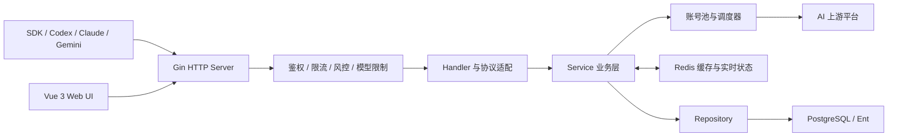
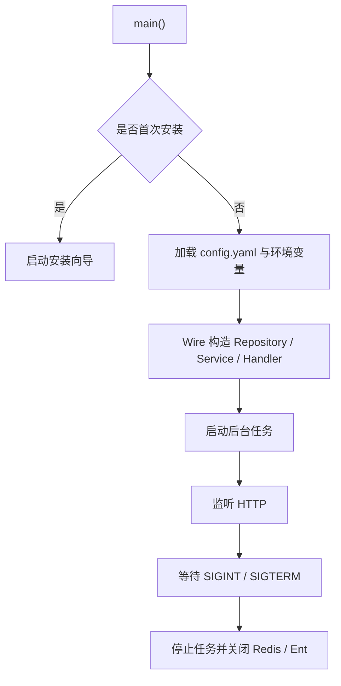
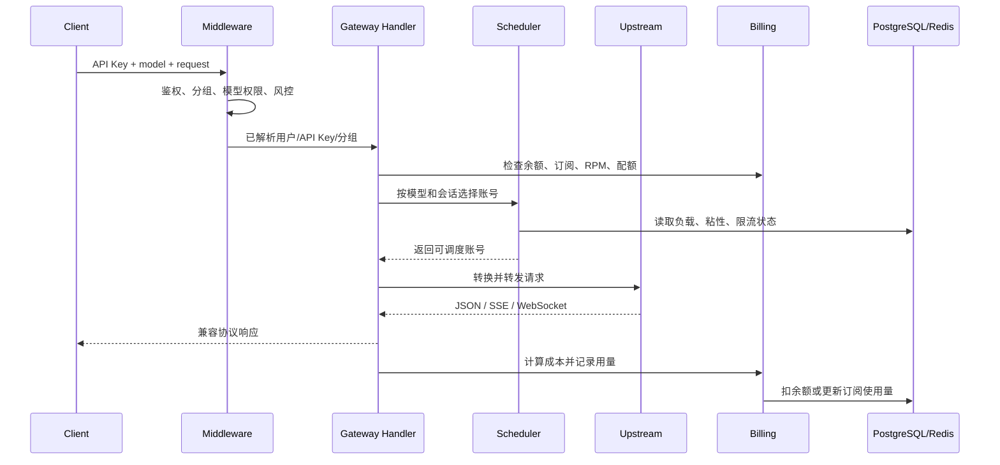

# Akimirai API 架构与接口说明

> 基于 `main` 分支当前实现整理。更新时间：2026-07-11。

## 1. 项目定位

Akimirai API 基于 Sub2API 演进，是一个多上游 AI API 网关和运营平台。
它不只转发请求，还负责：

- 统一 OpenAI、Anthropic、Gemini、Grok 等协议和上游账号。
- 按分组、模型、负载、配额和会话选择账号。
- 管理用户、API Key、余额、订阅、支付和用量。
- 提供风控、监控、告警、备份和管理后台。
- 将 Vue 前端构建后嵌入 Go 单文件服务。

当前代码规模快照：

| 项目 | 数量 |
| --- | ---: |
| HTTP 路由注册 | 536 |
| 管理路由 | 338 |
| Ent Schema | 40 |
| SQL 迁移 | 221 |

路由注册数包含协议别名和兼容入口，不等于独立业务能力数量。

## 2. 总体架构



核心分层：

| 层 | 目录 | 职责 |
| --- | --- | --- |
| 启动与装配 | `backend/cmd/server` | 启动、版本、Wire 依赖注入、优雅退出 |
| HTTP 路由 | `backend/internal/server` | Gin、全局中间件、HTTP Server |
| 路由定义 | `backend/internal/server/routes` | URL、鉴权边界、Handler 绑定 |
| Handler | `backend/internal/handler` | 参数解析、协议响应、流式连接 |
| Service | `backend/internal/service` | 调度、计费、订阅、支付、风控、监控 |
| Repository | `backend/internal/repository` | PostgreSQL、Redis、加密和缓存访问 |
| 数据模型 | `backend/ent/schema` | Ent Schema 和关系定义 |
| 数据迁移 | `backend/migrations` | PostgreSQL 增量迁移 |
| 前端 | `frontend/src` | Vue 页面、组件、状态和 API Client |

重要入口：

- [服务启动](../backend/cmd/server/main.go)
- [Wire 依赖装配](../backend/cmd/server/wire.go)
- [HTTP Server](../backend/internal/server/http.go)
- [路由总装配](../backend/internal/server/router.go)

## 3. 启动流程



后台任务包括用量写入、账号令牌刷新、过期处理、监控、告警、备份、
批量图片任务和计费缓存维护。

## 4. 网关请求原理

以 `/v1/responses` 或 `/v1/chat/completions` 为例：



入口中间件顺序可在
[gateway.go](../backend/internal/server/routes/gateway.go) 查看。

### 4.1 账号调度

调度不是简单轮询。主要条件包括：

1. API Key 所属分组和平台。
2. 请求模型及账号模型映射。
3. 账号是否启用、过期、限流或临时不可调度。
4. 账号优先级、并发、窗口费用和 RPM。
5. 会话粘性和上一次响应关联。
6. OpenAI WebSocket 连接池负载、错误率、TTFT 和队列。

主要实现位于：

- `backend/internal/service/gateway_scheduling.go`
- `backend/internal/service/openai_account_scheduler.go`
- `backend/internal/service/openai_gateway_scheduling.go`
- `backend/internal/service/channel_service.go`

### 4.2 协议适配

网关根据分组平台决定处理器：

- Anthropic 类账号：Claude Messages 原生或兼容转发。
- OpenAI 类账号：Responses、Chat Completions、WebSocket。
- Gemini：`/v1beta` 原生模型与生成接口。
- Grok：OpenAI 兼容文本、图片和视频入口。
- Antigravity：独立强制平台路由，避免混合账号调度。

协议转换集中在 `backend/internal/pkg/apicompat` 和各 Gateway Service。

### 4.3 计费

计费支持：

- Token 计费：输入、输出、缓存创建、缓存读取。
- 按请求计费。
- 图片按模型、尺寸和数量计费。
- 视频按模型、分辨率、数量和时长计费。
- 分组倍率、用户倍率、高峰倍率和渠道定价。
- 余额与订阅两种支付来源。

请求前由 `BillingCacheService` 检查资格，请求后由 `BillingService`
计算真实费用，并写入用量和余额/订阅账本。

## 5. 功能域

| 功能域 | 主要能力 |
| --- | --- |
| 认证 | 邮箱、JWT、Refresh Token、2FA、OAuth、微信、LinuxDo、OIDC、钉钉 |
| 用户 | 资料、身份绑定、隐私设置、余额、平台配额 |
| API Key | 创建、分组、配额、模型白名单、IP 限制、用量 |
| 账号池 | 多平台账号、OAuth、代理、模型映射、配额刷新 |
| 分组 | 平台隔离、定价、RPM、模型、回退组、账号绑定 |
| 渠道 | 模型目录、渠道定价、监控和请求模板 |
| 商业化 | 订阅、余额、充值、兑换码、优惠码、订单、退款 |
| 支付 | 支付宝、微信、Stripe、Airwallex 等提供商 |
| 媒体生成 | 图片、批量图片、任务管理、视频生成 |
| 邀请返利 | 邀请、返利、转账和用户专属配置 |
| 风控 | 内容审核、关键词/哈希命中、封禁、隐私过滤 |
| 运维 | 实时流量、错误、系统日志、告警、清理任务 |
| 数据管理 | 备份、恢复、S3、数据导入导出 |

## 6. API 总览

### 6.1 API 分类

| API | 前缀 | 认证 | 响应格式 |
| --- | --- | --- | --- |
| 公开/认证 | `/api/v1/auth`、`/api/v1/settings` | 部分公开 | 标准业务 Envelope |
| 用户业务 | `/api/v1/*` | JWT Bearer | 标准业务 Envelope |
| 管理业务 | `/api/v1/admin/*` | Admin JWT 或 `x-api-key` | 标准业务 Envelope |
| AI 网关 | `/v1/*` | API Key | OpenAI/Anthropic 兼容 |
| Gemini 网关 | `/v1beta/*` | API Key | Gemini 原生格式 |
| Codex 直连 | `/backend-api/codex/*` | API Key | Codex Responses 格式 |
| 支付回调 | `/api/v1/payment/webhook/*` | 提供商签名 | 提供商约定格式 |

### 6.2 认证头

用户 API：

```http
Authorization: Bearer <JWT>
```

网关 API 优先使用：

```http
Authorization: Bearer <API_KEY>
```

兼容头：

```http
x-api-key: <API_KEY>
x-goog-api-key: <API_KEY>
```

Admin API 还支持：

```http
x-api-key: <ADMIN_API_KEY>
```

### 6.3 业务响应格式

成功：

```json
{
  "code": 0,
  "message": "success",
  "data": {}
}
```

分页：

```json
{
  "code": 0,
  "message": "success",
  "data": {
    "items": [],
    "total": 0,
    "page": 1,
    "page_size": 20,
    "pages": 1
  }
}
```

错误可附带 `reason` 和 `metadata`。定义见
[response.go](../backend/internal/pkg/response/response.go)。AI 网关错误保持对应
协议格式，不使用此 Envelope。

### 6.4 公开 AI 网关接口

主要入口：

| 方法 | 路径 | 说明 |
| --- | --- | --- |
| `POST` | `/v1/messages` | Claude Messages；按分组平台自动路由 |
| `POST` | `/v1/messages/count_tokens` | Claude/OpenAI Token 统计兼容 |
| `GET` | `/v1/models` | 可用模型；Codex 客户端可返回 manifest |
| `GET` | `/v1/usage` | API Key 用量 |
| `POST` | `/v1/responses` | OpenAI Responses |
| `GET` | `/v1/responses` | Responses WebSocket |
| `POST` | `/v1/chat/completions` | OpenAI Chat Completions |
| `POST` | `/v1/embeddings` | Embeddings |
| `POST` | `/v1/images/generations` | 图片生成 |
| `POST` | `/v1/images/edits` | 图片编辑 |
| `POST` | `/v1/images/batches` | 批量图片任务 |
| `POST` | `/v1/videos/generations` | Grok 视频生成 |
| `GET` | `/v1/videos/:request_id` | 视频任务状态 |
| `GET` | `/v1beta/models` | Gemini 模型列表 |
| `POST` | `/v1beta/models/*modelAction` | Gemini 原生生成操作 |

另有不带 `/v1` 的兼容别名，以及 `/antigravity/v1`、
`/backend-api/codex` 专用入口。完整绑定见
[gateway.go](../backend/internal/server/routes/gateway.go)。

### 6.5 用户 API 域

[user.go](../backend/internal/server/routes/user.go) 注册登录后用户能力，主要包括：

- 用户资料、密码、身份绑定、2FA 和隐私配置。
- API Key CRUD、模型目录和快速接入配置。
- 用量、请求详情、错误请求和余额流水。
- 用户分组、订阅、充值、订单、兑换和返利。
- 公告、渠道状态、批量图片与任务管理。

认证相关公开和登录后接口见
[auth.go](../backend/internal/server/routes/auth.go)。

### 6.6 管理 API 域

管理 API 基础路径为 `/api/v1/admin`。主要资源组：

```text
/dashboard              /users                 /groups
/accounts               /channels              /proxies
/subscriptions          /payment               /usage
/ops                    /risk-control          /settings
/redeem-codes           /promo-codes           /announcements
/backups                /data-management       /system
/channel-monitors       /scheduled-test-plans  /affiliates
/error-passthrough-rules
/tls-fingerprint-profiles
```

完整管理路由见 [admin.go](../backend/internal/server/routes/admin.go)。管理接口
数量较大，应优先以对应前端 `frontend/src/api/admin` 和 Handler DTO 确认请求体。

### 6.7 支付 API

[payment.go](../backend/internal/server/routes/payment.go) 分为：

- `/api/v1/payment/*`：用户下单、查询和退款。
- `/api/v1/payment/public/*`：公开支付配置和能力。
- `/api/v1/payment/webhook/*`：支付提供商回调。
- `/api/v1/admin/payment/*`：管理端订单、计划和提供商配置。

支付契约详见：

- [支付说明](PAYMENT_CN.md)
- [管理支付 API](ADMIN_PAYMENT_INTEGRATION_API.md)

## 7. 数据与状态

### PostgreSQL

PostgreSQL 是业务事实来源，保存用户、身份、API Key、账号、分组、订阅、
订单、用量、监控、风控和任务记录。

Ent Schema 位于 `backend/ent/schema`。生成代码位于 `backend/ent`，不应手工
修改。数据库升级由 `backend/migrations/*.sql` 管理。

### Redis

Redis 保存可重建或实时状态：

- JWT/Refresh Token 和限流状态。
- API Key、余额、订阅和模型目录缓存。
- 并发、RPM、账号负载和粘性会话。
- 调度快照、监控指标、队列和失效通知。

Redis 不是用户、订单、账单等业务事实的最终所有者。

## 8. 前端架构

前端使用 Vue 3、TypeScript、Vite、Pinia、Vue Router、Axios 和 Tailwind。

```text
frontend/src/
├── api/          HTTP Client 与领域 API
├── components/   可复用组件
├── composables/  组合式状态和交互逻辑
├── stores/       Pinia 全局状态
├── router/       页面路由和守卫
├── views/        用户端、管理端、认证页面
├── types/        前后端共享形状的 TS 表达
├── utils/        格式化、定价、模型和安全工具
└── i18n/         中英文文案
```

Axios Client 自动添加 JWT、语言和时区，解包标准业务 Envelope，并串行处理
Token 刷新。实现见 [client.ts](../frontend/src/api/client.ts)。

页面路由见 [router/index.ts](../frontend/src/router/index.ts)。生产构建输出到
`backend/internal/web/dist`，最终嵌入 Go 二进制。

## 9. 部署架构

默认 Docker Compose 包含：

```text
sub2api + PostgreSQL + Redis
```

根 [Dockerfile](../Dockerfile) 使用多阶段构建：

1. pnpm 构建 Vue 前端。
2. Go 编译并嵌入前端资源。
3. 最终 Alpine 镜像加入 `pg_dump`/`psql`。
4. 非 root 用户运行，暴露 `8080`。

生产环境应在本地或大内存构建机生成镜像/二进制，再上传服务器。不要在资源
有限的生产 ECS 上执行重型 Docker/Go 构建。

部署入口：

- [Docker Compose](../deploy/docker-compose.yml)
- [部署说明](../deploy/README.md)
- [Docker 说明](../deploy/DOCKER.md)

## 10. 目录所有权

```text
Akimirai-api/
├── backend/               Go 后端和数据库定义
├── frontend/              Vue 主前端
├── gpt-image-playground/  图片工作台源码，当前仍为独立未跟踪集成区
├── deploy/                部署配置和脚本
├── docs/                  长期文档
├── assets/                项目静态资源
├── tools/                 运维/迁移辅助工具
├── output/                本地构建、导出、诊断产物；非源码
├── dist/                  可重建发布二进制
├── .trellis/              本地任务、规范和工作日志
└── .github/               CI、发布和安全扫描
```

边界规则：

| 类型 | 示例 | 处理方式 |
| --- | --- | --- |
| 源码 | `backend`、`frontend` | Git 管理，修改后测试 |
| 生成源码 | `backend/ent` | 由 Ent 生成并提交 |
| 数据迁移 | `backend/migrations` | 只追加/修正，不随意删除 |
| 本地依赖 | `node_modules` | 可删除并重新安装 |
| 构建产物 | `dist`、`output` | 可重建，定期归档或清理 |
| 运行配置 | `config.yaml`、`.env` | 本地保存，不提交秘密 |
| 运行数据 | PostgreSQL、Redis、`dump.rdb` | 删除前必须备份和确认 |

## 11. 本地开发

```powershell
# 前端
cd F:\Akimirai-api\frontend
pnpm install --frozen-lockfile
pnpm dev

# 后端
cd F:\Akimirai-api\backend
go run ./cmd/server/
```

默认地址：

- 前端：`http://127.0.0.1:3000`
- 后端：`http://127.0.0.1:8080`
- PostgreSQL：`127.0.0.1:5432`
- Redis：`127.0.0.1:6379`

## 12. 文档边界与缺口

当前仓库没有完整 OpenAPI/Swagger 规范。本文提供架构和接口族说明，但不替代
逐接口 Schema 文档。精确请求/响应应按以下优先级确认：

1. `backend/internal/server/routes`：路径、方法、鉴权。
2. `backend/internal/handler` 与 DTO：请求和响应形状。
3. `backend/internal/service`：业务规则。
4. `frontend/src/api`：当前前端实际调用方式。
5. 测试：边界、错误码和兼容行为。

后续适合补充：

- 自动生成的路由清单。
- 用户 API 和 Admin API 的 OpenAPI Schema。
- 网关协议兼容矩阵。
- 关键请求的时序图和故障处理表。
